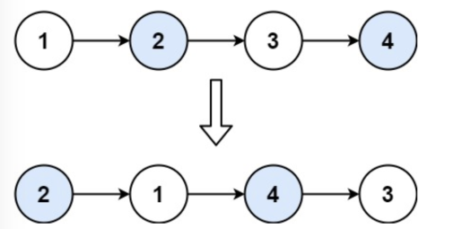
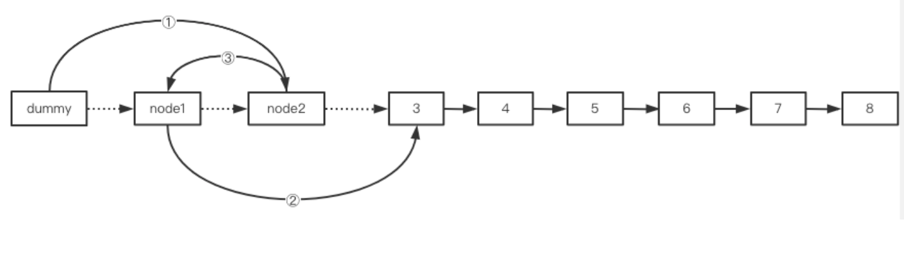

# Algorithem
## 算法通关村第一关 LinkedList Level1 —— 双向链表
双链表与单链表相比, 每个结点增加了前驱结点`prior`的引用, 结点结构如下图所示:


### 1. 定义双链表

双向链表包含`数据域`**`val`**(以整型为例), `前驱引用`**`prior`**, `后继引用`**`next`**. 定义如下:

```java
static class Node {
        public int val;
        public Node prior;
        public Node next;

        public Node(int x) {
            val = x;
            prior = next = null;
        }
    }
```

### 2. 双链表插入

**(1) 表头插入**  
在双链表表头插入结点主要分为以下三步:  
① `newNode.next = head`  
② `head.prior = newNode`  
③ `head = newNode`  

**(2) 中间插入**  
在双链表的中间插入新结点的思路与单链表的插入相同, 首先遍历双链表, 找到要插入位置`position`的前一个结点 `pNode`, `pNode`为新结点`newNode`的前驱, `pNode.next`为`newNode`的后继. 一个可行步骤如下:  
①  `newNode.next = pNode.next`  
② *`pNode.next.prior = newNode  // 当心空指针!`  
③  `newNode.prior = pNode`  
④  `pNode.next = newNode`  
双向链表的中间插入操作顺序不唯一, 但在上面这种情况下, 因为插入前我们持有的是前驱结点 **pNode** , 第 ④ 步一定要在第 ① 步之后, 不然链表的后半段就丢失了.  
⚠若在尾部插入, 由于遍历到`pNode`恰是**尾结点**, `pNode.next`为`null`, 接着执行第②步则会报空指针, 因此第②步执行前应判空, `pNode.next != null`

**(3) 尾部插入**  
在双链表的结尾插入新结点也简单, 先遍历到尾结点 **tail** , 接着按步骤如下:  
① tail.next = newNode  
② newNode.prior = tail  

完整实现:

```java
    /**
     * 双链表插入
     *
     * @param head      头结点点
     * @param newNode   待插入结点
     * @param position  结点插入位置
     * @return          插入后的头结点
     */
    public static Node insert(Node head, Node newNode, int position) {
        // 判空
        if (head == null) {
            return newNode;
        }
        // 越界判断
        int size = getLength(head);
        if (position > size + 1 || position < 1) {
            System.err.println("IndexOutOfBound");
            return head;
        }
        // 表头位置插入
        if (position == 1) {
            newNode.next = head;
            head.prior = newNode;
            head = newNode;
            return head;
        }
        // 中间位置插入
        Node pNode = head;

        int index = 1;
        while (index < position - 1) {
            pNode = pNode.next;
            index++;
        }
        newNode.next = pNode.next;
        // 如果是尾插, pNode.next 为 null, 会报空指针
        if (pNode.next != null) {  // 因此需要判空
            pNode.next.prior = newNode;
        }
        newNode.prior = pNode;
        pNode.next = newNode;
        return head;
    }
```


### 3. 双链表删除

**(1) 删除表头结点**  
删除头结点比较简单, 步骤如下: 

1.  `head = head.next  // 移动头结点`
2.  `head.prior = null // 新的头结点前继置为null`

**(2) 删除最后一个结点**  
删除尾结点也比较简单, 先遍历到尾结点的前一结点`pNode`, 接着只需一步:  

1. `pNode.next = null  // 剔除尾结点`

**(3) 删除中间结点**  
删除中间结点, 先遍历到要删除位置的前一个结点 `pNode`, 接着步骤如下:

1.  `pNode.next = pNode.next.next  // 指向后一个结点`
2. *`pNode.next.prior = pNode     // 当心空指针!`

⚠若删除的是尾结点, 由于第1步使`pNode.next` 变为 `null`, 执行到第2步会报空指针, 因此第2步执行前需要判空, `pNode.next != null`

```java
    /**
     * 双链表删除
     * 
     * @param head      头结点
     * @param position  待删除结点位置
     * @return          删除结点后的双链表
     */
    public static Node delete(Node head, int position) {
        // 双链表为空
        if (head == null) {
            return null;
        }
        // 判断越界
        int size = getLength(head);
        if (position > size || position < 1) {
            System.err.println("位置参数越界");
            return head;
        }
        // 删除头结点
        if (position == 1) {
            head = head.next;
            head.prior = null;
            return head;
        }
        // 删除中间及尾结点
        Node pNode = head;

        int count = 1;
        while (count < position - 1) {
            pNode = pNode.next;
            count++;
        }
        pNode.next = pNode.next.next;
        // todo 删除尾结点判空
        if (pNode.next != null) {
            pNode.next.prior = pNode;  // 处理前驱
        }
        return head;
    }
```

## 算法通关村第一关——链表经典问题之双指针专题

### 1. 寻找中间结点 LeetCode876.

LeetCode876: 给定一个头结点为 head 的非空单链表，返回链表的中间结点。如果有两个中间结点，则返回第二个中间结点。

```
示例1
输入：[1,2,3,4,5]
输出：此列表中的结点 3
示例2：
输入：[1,2,3,4,5,6]
输出：此列表中的结点 4
```

**常规方法:** 先遍历获得链表长度，除以2即中间结点的位置，再一次遍历到中间位置即可。  
**双指针法:** 慢指针一次移动 1 个单位，快指针一次移动 2 个单位。当快指针移动到结尾时，慢指针正好处于链表的中间。分析可知若链表结点数为**奇数** ，最终慢指针恰为中间结点；若链表结点数位**偶数**，慢指针最终处于第二个中间结点。代码结尾直接返回慢指针即可。  
**方法比较:** 常规思路需要遍历1.5次链表，而使用双指针法相当于只遍历了一次。  
双指针法实现如下：

```java
public static ListNode middleNode(ListNode head) {
    ListNode slow = head, fast = head;
    while(fast != null && fast.next != null) {
        slow = slow.next;
        fast = fast.next.next;
    }
    return slow;
}
```

### 2. 寻找倒数第K个元素 

要求: 输入一个链表，输出该链表中倒数第k个节点。本题从1开始计数，即链表的尾节点是倒数第1个节点。

```
示例
给定一个链表: 1->2->3->4->5, 和 k = 2.
返回链表 4->5.
```

**常规方法:** 先遍历链表得到长度 len，再遍历到`len - k + 1`处即倒数第 k 个元素。  
**双指针法：** 快指针先移动 k 个单位，接着双指针同时移动，直到快指针位 null，此时慢指针正指向倒数第 k 个结点。  
双指针法实现如下：

```java
public static ListNode getKthFromEnd(ListNode head, int k) {
    ListNode slow = head, fast = head;
    if (k < 1) {
        System.out.println("参数有误");
        return null;
    }
    while (k > 0 && fast != null) {
        fast = fast.next;
        k--;
    }
    if (k > 0) {
        System.out.println("参数有误");
        return null;
    }
    while (fast != null) {
        slow = slow.next;
        fast = fast.next;
    }
    return slow;
}
```

### 3. 旋转链表 LeetCode61.

LeetCode61: 给你一个链表的头节点 head ，旋转链表，将链表每个节点向右移动 k 个位置。

```
示例1:
输入：head = [1,2,3, 4,5], k = 2
输出：[4,5,1,2,3]
```

**分析：** 将每个结点右移 k 个位置相当于**将最后 k 个结点这一整段插入到链表首部**。可知，设链表的长度为 len，若 k 为 len 的整数倍，链表相当于没有移动。  
**常规方法：** 首先遍历获得链表的长度 len，再遍历到`len - ( k % len ) `位置处则找到链表旋转后的尾结点，其下一个结点( next )即旋转后的头结点。通过结点操作即可完成旋转。  
**双指针法：** 先令快指针右移 k 步，接着快慢指针同时移动，直到快指针为最后一个结点。此时慢指针正好处于 k 个结点段的前一个位置，即**新的尾结点** (next即为**新头结点** )，快指针恰好指向 k 个结点段的**最后一个结点** 。找到了这些关键结点，接着通过链表操作即可完成链表的旋转，最后将**新头结点** 返回即可。  
双指针法实现如下：

```java
public static ListNode rotateRight(ListNode head, int k) {
    if (head == null || k == 0) {  // todo k == 0 遗漏
        return null;
    }
    ListNode slow = head, fast = head; // 定义双指针
    int len = 0;
    ListNode cur = head;
    // 遍历获得链表长度 len
    while (cur != null) {
        len++;
        cur = cur.next;
    }
    // todo 代码优化: k % len == 0 直接返回 head 即可
    if (k % len == 0) {
        return head;
    }
    // k %= len;  // k mod 链表长度 len, 模运算确定等效最小右旋次数 k
    // todo 代码优化: 依旧是上一条优化的思路, 优化后可推断出fast不会为null, 因此条件 fast!=null 多余了
    while (k % len > 0) {
        fast = fast.next;
        k--;
    }
    // while (fast != null && k > 0) {  // 快指针首先移动 k 步
    //     fast = fast.next;
    //     k--;
    // }
    // 快慢指针同时移动, 直到快指针到达尾结点为止
    while (fast.next != null) {
        slow = slow.next;
        fast = fast.next;
    } // 循环结束时, 慢指针即为新尾结点, slow.next即为新的头结点
    fast.next = head; // 成环
    head = slow.next; // 指定新头结点
    slow.next = null; // 断开
    return head; // 返回旋转后的链表头结点
}
```

### 小结

双指针法可以很方便的寻找到**中间结点**或**倒数某一个结点**，虽然常规方法也能解决但不如前者来的直接，前者用于指针移动的循环的次数更少，代码实现也更加简洁。另外，寻找倒数第 K 个元素问题还是旋转链表的子问题。

## 算法通关村第二关——链表反转

### 1. 使用虚拟头结点

首先创建一个虚拟头结点, 然后从左到右将链表上的结点**一个一个地插入到虚拟头结点之后**, 最后返回虚拟头结点 next 域即可. 代码实现如下:  
```java
public static ListNode reverseWithDummyHead(ListNode head) {
    ListNode dummy = new ListNode(-1);
    ListNode cur = head, next = null;
    while (cur != null) {
        next = cur.next;
        cur.next = dummy.next;  // 一个一个
        dummy.next = cur;        // 插入到虚拟头结点之后
        cur = next;
    }
    return dummy.next;
}
```

### 2. 直接反转

从左到右将链表上的结点**作为反转链表的新头结点**即可, 最后一个结点即反转链表的最终头结点.

```java
public static ListNode reverseList(ListNode head) {
    ListNode cur = head, next, rev = null;  // rev 即表示反转链表
    while (cur != null) {
        next = cur.next;
        cur.next = rev;  // 作为反转链表
        rev = cur;        // 的新头结点
        cur = next;
    }
    return rev;
}
```

### 3. 递归反转

通过**递归**的方式来反转链表

```java
public static ListNode reverseListRecur(ListNode head) {
    if (head == null || head.next == null) {
        return head;
    }
    ListNode newHead = reverseListRecur(head.next);
    head.next.next = head;
    head.next = null;
    return newHead;
}
```

### 小结

链表反转是高频的算法面试题, 无论是使用虚拟头结点辅助反转还是直接反转, 都是常用的链表反转方法, 必须达到熟练手写链表反转的程度. 递归实现链表反转比较开阔思路, 可以加深对递归这一重要算法思想的理解.

## 算法通关村第二关——两两交换反转问题解析

### 1. 问题

LeetCode24. 给你一个链表, 两两交换其中相邻的结点, 并返回交换后链表的头节点. 你必须在不修改结点内部值的情况下完成本题(即, 只能进行结点交换). 示例如下: 

```
输入: head = [1,2,3,4]
输出: [2,1,4,2]
```



### 2. 分析

因为两两交换实际上涉及到插入操作, 因此借助 `dummyHead` 可以简化代码的实现. 现在对问题建立一个模型, 对于需要交换的两个结点称之为 **swap pair**, 分别使用 `node1` 与 `node2` 表示, **swap pair 的前驱结点**使用 `cur` 表示, 而 **swap pair 的后继**实际上就是 `node2.next`. 建立起了编码模型后, 按如下步骤操作: 



核心代码如下: 

```java
/**
 *    pre 初始化为 dummy
 *  node1 初始化为 pre.next (if not null)
 *  node2 初始化为 pre.next.next (if not null)
 *  循环以下操作, 直到 node1 或 node2 为 null
 */
cur.next = node2;		 	// 1. 前驱 -> swap pair
node1.next = node2.next; 	// 2. swap pair -> 后继
node2.next = node1;		 	// 3. node2 -> node1 
cur = node1;             	// 4. 更新前驱 cur -> node1
```

### 3. 完整实现

```java
public static ListNode swapPairs(ListNode head) {
    ListNode dummy = new ListNode(-1);
    dummy.next = head;
    ListNode cur = dummy, node1 = null, node2 = null;
    while (cur.next != null && cur.next.next != null) { // node1 存在 且 node2 也存在
        node1 = cur.next;
        node2 = cur.next.next;
        cur.next = node2;            // 1. pair 的前驱
        node1.next = node2.next;     // 2. pair 的后继
        node2.next = node1;          // 3. node2 -> node1
        cur = node1;                 // 4. 更新关键循环变量 cur 为 node1
    }
    return dummy.next;
}
```

## 算法通关村——不简单的数组增删改查

### 1. 数组创建和初始化

使用Java创建和初始化数组大致有3种方式:  
```java
/**  创建一个数组, 初始化为 { 1, 2, 3, 4, 5 }  **/

// 方式一: 
int[] a = new int[5];
for (int i = 0; i < a.length; i++) {
    a[i] = i + 1;
}

// 方式二:
int[] a = new int[] {1, 2, 3, 4, 5};

// 方式三:
int[] a = {1, 2, 3, 4, 5};
```

### 2. 查找

在一个数组中查找特定元素有多种方法, 最简单的就是遍历, 存在返回其索引, 否则返回-1. 若数组有序还可以使用二分查找等更高效但实现更复杂的算法. 这里只放最简单的遍历查找方法:  
**数组无序的情况**: (遍历, 等于返回索引, 直到结束)

```java
public static int searchOutOfOrder(int a[], int size, int key) {
    for (int i = 0; i < size; i++) {
        if (key == a[i]) {
            return i;
        }
    }
    return -1;
}
```

**数组有序的情况**: (遍历, 等于返回索引, once大于但不等于就提前结束)

```java
public static int searchInOrder(int a[], int size, int key) {
    int index = -1;
    for (int i = 0; i < size; i++) {
        if (key >= a[i]) {
            index = i;
            break;
        }
    }
    return index != -1 ? index : -1;
}
```

### 3. 增加

​		数组元素的增加更为常见的形式是往有序的数组中新增元素, 返回插入后元素的下标. 若数组的实际大小 size 已等于数组容量 length, 则无法继续增加新元素, 需要扩容, 这里不作讨论, 直接返回 -1 即可.  
​		现在讨论**数组有序**的情况增加元素. 因为数组有序, 插入前先可以先找到第一个比待插入元素 element 大的元素, 该元素及其之后的元素全部都后移一步, 将 element 插入空位即可.  
​		此处介绍两种遍历查找再插入的方式:  
**① 从前往后查找位置**  
​		从头(**最小**)开始依次与当前元素比较, 找到**第一个大于 element 的元素**(**索引**),  然后空出该处(当前及之后元素后移), 插入. 若未找到, 说明 element 是最大的, 直接将其插入**索引 size 处**. 实现如下: 

```java
public static int addByElementSequence(int[] arr, int size, int element) {
    if (size >= arr.length) {  
        return -1;
    }
    int index = size;
    for(int i = 0; i < size; i++) {
        if (element < arr[i]) {
            index = i;
            break;
        }
    }
    for(int j = size; j > index; j--) {
        arr[j] = arr[j - 1];
    }
    arr[index] = element;
    return index;
}
```

​		该方式要先遍历比较, 确定后挪元素的第一个元素的索引, 然后再遍历这些元素使之后移, 最后插入. 需要写两次遍历的for语句.

**② 从后往前查找位置**  
		从后(**最大**)往前与当前元素比较, 若 **element 更大或与之相等**, 直接插入当前元素之后即可, 否则将当前元素后移一位. 如此循环, 直到插入. 若结束仍未插入, 说明 element 是最小的, 直接插入**索引 0 处**(**已空出**). 实现如下: 

```java
public static int addByElementSequenceFromEnd(int[] arr, int size, int element) {
    if (size >= arr.length) {
        return -1;
    }
    int index = 0;
    for (int i = size; i > 0; i--) {
        if (element >= arr[i - 1]) {  
            index = i;
            break;
        } else {
            arr[i] = arr[i - 1];  
        }	
    }
    arr[index] = element;
    return index;
}
```

​		该方式比从前往后的**效率更高**, 一边比较一边后移, 之前比 element 小的元素都无须比较. 只需要写一个 for 循环即可.

### 4. 删除

​		数组删除的一般形式是删除指定值的元素, 本质上就是使得后面的元素将其覆盖, 之后的元素整体后移. 若删除的是最后一个元素, 实际上只需要 size 减 1 即可. 若数组是有序的, 则可以通过二分查找等方法先找到目标元素, 然后删除.  
​		讨论数组无序的情况. 这里通过遍历数组, 找到与目标元素 key 值相同的元素索引, 然后当前及之后的元素都向前移动一步, 覆盖原来那个元素, 返回删除后数组 size. 若未找到, 说明 key 不存在, 直接返回 size 即可.   
​		注意, 如果 key 恰为最后一个元素, 实际上进行覆盖操作的 for 循环是不会执行的, 因为如果 size 等于 length, size - 1处的元素不可能移动到 size (length) 的位置, 越界了. 根本不会进入执行覆盖操作的循环. 直接 size 减一即可.

```java
public static int removeByElement(int[] arr, int size, int key) {
    int index = -1;
    for (int i = 0; i < size; i++) {
        if (key == arr[i]) {
            index = i;
            break;
        }
    }
    if (index == -1) {
        return size;
    }
    for (int j = index + 1; j < size; j++) {
        arr[j - 1] = arr[j];
    }
    return --size;
}
```

## 算法通关村——双指针的妙用（数组的区间专题）

### 1. 寻找最小有序区间 LeetCode228.

> 给定一个无重复元素的有序整数数组nums. 返回恰好覆盖数组中所有数字的最小区间列表. 也就是说, nums 的每个元素都恰好只处于某一个区间, nums 中不存在不属于某个区间的元素. 

```java
示例1:
输入: nums = [0,1,2,4,5,7]
输出: ["0->2", "4->5", "7"]
对应关系:
[0,2] >> "0->2"
[4,5] >> "4->5"
[7,7] >> "7"

示例2:
输入:nums = [0,2,3,4,6,8,9]
输出:["0", "2->4", "6", "8->9"]
对应关系:
[0,0] >> "0"
[2,4] >> "2->4"
[6,6] >> "6->6"
[8,9] >> "8->9"
```

**1. 思路分析** 数组的**双指针**思想  
设置快慢指针 `slow` 与 `fast` .  
使得 slow 与 fast 分别指向一段连续元素的头元素和尾元素, 当只有一个元素连续的时候 slow 与 fast 同时指向该元素. 如果区间为前者则表示成 [slow] -> [fast], 为后者则表示成 [slow] 即可.  因此:  
`slow` 表示区间的起点.  
`fast` 表示区间的终点.  
两者可以相等.

1. slow 初始为 0, fast 遍历数组, 找到当前区间的终点.  
   当遇到不连续时, **打破连续**的元素的前一个元素即当前区间终点. 即当 `[fast + 1] > [fast] + 1`时, fast 为当前区间终点.  注意, fast 遍历到**数组的结尾处一定会打破连续**, 因为没有后续的元素了. 此时 fast == length - 1 即为当前区间同时也是最后一个区间的终点. 
2. 判断起点与终点是否相等, 确定区间的字符串表示.  
   相等, 则表示该区间只有一个元素, 用 **"[slow]"** 表示即可.  
   否则, 表示该区间有多个元素, 用 **"[slow] -> [fast]"** 表示.  
   然后将表示区间的字符串放入容器对象保存(例如, List)
3. 更新 slow , 指向下一个新起点.
   即将 slow 指向打破连续的那个元素, `slow = fast + 1` .  

**2. 代码实现**

```java
import java.util.List;
import java.util.ArrayList;

public static List<String> summaryRanges(int[] nums) {
    List<String> ranges = new ArrayList<>();
    int slow = 0;
    for (int fast = 0; fast < nums.length; fast++) {
        if (fast + 1 == nums.length || nums[fast + 1] > nums[fast] + 1) {  // 确定区间终点 fast
            String range = slow != fast ? nums[slow] + "->" + nums[fast] : nums[slow] + "";
            ranges.add(range);
            slow = fast + 1;  // 下一个区间起点 fast+1
        }
    }
    return ranges;
}
```


### 2. 寻找缺失区间 LeetCode163.

> 把LeetCode228. 的问题反过来, 寻找缺失的区间.

```java
示例:
输入: nums = [0,1,3,50,75] lower = 0 upper = 99
输出: ["2", "4->49", "51->74", "76->99"]
```

**1.思路分析**  遍历即可   
**写在最前面:**   
  本题要寻找**缺失区间**(简称为**缺失**). 由于 lower 与 upper 的限制, 我们将 **[lower, upper]** 定义为**有效的缺失区间范围**. 完全处于该范围外的缺失是无效的, 因此结合题目条件我们可以通过判断, **跳过**或**直接结束**缺失的寻找. 而对于那些与有效区间只有部分交集的缺失, 需要将其超出的部分**切除**.  
  循环变量 i . 遍历整个数组,  如果 i 与 i + 1 指向的**相邻两个元素不连续**, 例如 i -> 1, i + 1-> 4. 则缺失区间的起点为 **[i] + 1**, 终点为 **[i + 1] - 1**.  如果 i 到了数组结尾, 也会导致不连续, 此时终点直接便是 upper.

1. 根据区间限制条件 lower 与 upper 进行 break 与 continue  
   ① 若 [i] >= upper, 则缺失起点(+1)必定**大于 upper**, 则当前与之后都没有有效的缺失, beak直接结束即可.  
   ② 若 [i + 1] <= lower, 则缺失的终点(-1)必定**小于 lower**, 直接 continue 跳过进入下一轮循环即可.
2. 如果能够进入第2步, 且 [i] 与 [i + 1] 不连续或者 i 为数组结尾, 则存在缺失, 对其中超出有效区间的部分直接切除.  
   ① 缺失**起点与 lower 两者取其大**: `Math.max([i] + 1, lower)`  
   ② 缺失**终点与 upper 两者取其小**: `Math.min([i + 1] - 1, upper)`  
   若 i 为结尾, 那么终点直接为 upper.  
   接着, 若起点等于终点, 则缺失表示为字符串 "起点". 否则表示为 "起点->终点" . 将其放入容器中, 如 List .  
3. 更新 i , 重复 1, 2, 直到 break 或循环结束.

**2.代码实现**

```java
import java.util.List;
import java.util.ArrayList;
import static java.lang.Math.min;
import static java.lang.Math.max;

public static List<String> findLostRanges(int[] nums, int lower, int upper) {
    List<String> ranges = new ArrayList<>();
    for (int i = 0; i < nums.length; i++) {
        if (nums[i] >= upper) break;
        if (i + 1 < nums.length && nums[i + 1] <= lower) continue;
        if (i + 1 == nums.length || nums[i + 1] > nums[i] + 1) {
            int L = max(nums[i] + 1, lower);
            int R = i + 1 != nums.length ? min(nums[i + 1] - 1, upper) : upper;
            String range = L != R ? L + "->" + R : L + "";
            ranges.add(range);
        }
    }
    return ranges;
}
```

### 小结

  数组区间问题的关键在于**判断元素的连续性**. 一段连续的元素必定两两之差为1, 从确定某一元素为起点开始, 若碰到不连续的元素, 则该元素的前一元素即连续区间的终点; 若两相邻元素不连续, 即两者之差大于1, 则存在缺失区间, 终点与起点即前者+1, 后者-1.

