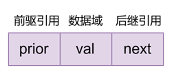

# Algorithem
## 算法通关村第一关 LinkedList Level1 —— 双向链表
双链表与单链表相比, 每个结点增加了前驱结点`prior`的引用, 结点结构如下图所示:



### 1. 定义双链表

双向链表包含`数据域`**`val`**(以整型为例), `前驱引用`**`prior`**, `后继引用`**`next`**. 定义如下:

```java
static class Node {
        public int val;
        public Node prior;
        public Node next;

        public Node(int x) {
            val = x;
            prior = next = null;
        }
    }
```

### 2. 双链表插入

**(1) 表头插入**  
在双链表表头插入结点主要分为以下三步:  
① `newNode.next = head`  
② `head.prior = newNode`  
③ `head = newNode`  

**(2) 中间插入**  
在双链表的中间插入新结点的思路与单链表的插入相同, 首先遍历双链表, 找到要插入位置`position`的前一个结点 `pNode`, `pNode`为新结点`newNode`的前驱, `pNode.next`为`newNode`的后继. 一个可行步骤如下:  
①  `newNode.next = pNode.next`  
② *`pNode.next.prior = newNode  // 当心空指针!`  
③  `newNode.prior = pNode`  
④  `pNode.next = newNode`  
双向链表的中间插入操作顺序不唯一, 但在上面这种情况下, 因为插入前我们持有的是前驱结点 **pNode** , 第 ④ 步一定要在第 ① 步之后, 不然链表的后半段就丢失了.  
⚠若在尾部插入, 由于遍历到`pNode`恰是**尾结点**, `pNode.next`为`null`, 接着执行第②步则会报空指针, 因此第②步执行前应判空, `pNode.next != null`

**(3) 尾部插入**  
在双链表的结尾插入新结点也简单, 先遍历到尾结点 **tail** , 接着按步骤如下:  
① tail.next = newNode  
② newNode.prior = tail  

完整实现:

```java
    /**
     * 双链表插入
     *
     * @param head      头结点点
     * @param newNode   待插入结点
     * @param position  结点插入位置
     * @return          插入后的头结点
     */
    public static Node insert(Node head, Node newNode, int position) {
        // 判空
        if (head == null) {
            return newNode;
        }
        // 越界判断
        int size = getLength(head);
        if (position > size + 1 || position < 1) {
            System.err.println("IndexOutOfBound");
            return head;
        }
        // 表头位置插入
        if (position == 1) {
            newNode.next = head;
            head.prior = newNode;
            head = newNode;
            return head;
        }
        // 中间位置插入
        Node pNode = head;

        int index = 1;
        while (index < position - 1) {
            pNode = pNode.next;
            index++;
        }
        newNode.next = pNode.next;
        // 如果是尾插, pNode.next 为 null, 会报空指针
        if (pNode.next != null) {  // 因此需要判空
            pNode.next.prior = newNode;
        }
        newNode.prior = pNode;
        pNode.next = newNode;
        return head;
    }
```


### 3. 双链表删除

**(1) 删除表头结点**  
删除头结点比较简单, 步骤如下: 

1.  `head = head.next  // 移动头结点`
2.  `head.prior = null // 新的头结点前继置为null`

**(2) 删除最后一个结点**  
删除尾结点也比较简单, 先遍历到尾结点的前一结点`pNode`, 接着只需一步:  

1. `pNode.next = null  // 剔除尾结点`

**(3) 删除中间结点**  
删除中间结点, 先遍历到要删除位置的前一个结点 `pNode`, 接着步骤如下:

1.  `pNode.next = pNode.next.next  // 指向后一个结点`
2. *`pNode.next.prior = pNode     // 当心空指针!`

⚠若删除的是尾结点, 由于第1步使`pNode.next` 变为 `null`, 执行到第2步会报空指针, 因此第2步执行前需要判空, `pNode.next != null`

```java
    /**
     * 双链表删除
     * 
     * @param head      头结点
     * @param position  待删除结点位置
     * @return          删除结点后的双链表
     */
    public static Node delete(Node head, int position) {
        // 双链表为空
        if (head == null) {
            return null;
        }
        // 判断越界
        int size = getLength(head);
        if (position > size || position < 1) {
            System.err.println("位置参数越界");
            return head;
        }
        // 删除头结点
        if (position == 1) {
            head = head.next;
            head.prior = null;
            return head;
        }
        // 删除中间及尾结点
        Node pNode = head;

        int count = 1;
        while (count < position - 1) {
            pNode = pNode.next;
            count++;
        }
        pNode.next = pNode.next.next;
        // todo 删除尾结点判空
        if (pNode.next != null) {
            pNode.next.prior = pNode;  // 处理前驱
        }
        return head;
    }
```

## 算法通关村第一关——链表经典问题之双指针专题

### 1. 寻找中间结点 LeetCode876.

LeetCode876: 给定一个头结点为 head 的非空单链表，返回链表的中间结点。如果有两个中间结点，则返回第二个中间结点。

```
示例1
输入：[1,2,3,4,5]
输出：此列表中的结点 3
示例2：
输入：[1,2,3,4,5,6]
输出：此列表中的结点 4
```

**常规方法:** 先遍历获得链表长度，除以2即中间结点的位置，再一次遍历到中间位置即可。  
**双指针法:** 慢指针一次移动 1 个单位，快指针一次移动 2 个单位。当快指针移动到结尾时，慢指针正好处于链表的中间。分析可知若链表结点数为**奇数** ，最终慢指针恰为中间结点；若链表结点数位**偶数**，慢指针最终处于第二个中间结点。代码结尾直接返回慢指针即可。  
**方法比较:** 常规思路需要遍历1.5次链表，而使用双指针法相当于只遍历了一次。  
双指针法实现如下：

```java
public static ListNode middleNode(ListNode head) {
    ListNode slow = head, fast = head;
    while(fast != null && fast.next != null) {
        slow = slow.next;
        fast = fast.next.next;
    }
    return slow;
}
```

### 2. 寻找倒数第K个元素 

要求: 输入一个链表，输出该链表中倒数第k个节点。本题从1开始计数，即链表的尾节点是倒数第1个节点。

```
示例
给定一个链表: 1->2->3->4->5, 和 k = 2.
返回链表 4->5.
```

**常规方法:** 先遍历链表得到长度 len，再遍历到`len - k + 1`处即倒数第 k 个元素。  
**双指针法：** 快指针先移动 k 个单位，接着双指针同时移动，直到快指针位 null，此时慢指针正指向倒数第 k 个结点。  
双指针法实现如下：

```java
public static ListNode getKthFromEnd(ListNode head, int k) {
    ListNode slow = head, fast = head;
    if (k < 1) {
        System.out.println("参数有误");
        return null;
    }
    while (k > 0 && fast != null) {
        fast = fast.next;
        k--;
    }
    if (k > 0) {
        System.out.println("参数有误");
        return null;
    }
    while (fast != null) {
        slow = slow.next;
        fast = fast.next;
    }
    return slow;
}
```

### 3. 旋转链表 LeetCode61.

LeetCode61: 给你一个链表的头节点 head ，旋转链表，将链表每个节点向右移动 k 个位置。

```
示例1:
输入：head = [1,2,3, 4,5], k = 2
输出：[4,5,1,2,3]
```

**分析：** 将每个结点右移 k 个位置相当于**将最后 k 个结点这一整段插入到链表首部**。可知，设链表的长度为 len，若 k 为 len 的整数倍，链表相当于没有移动。  
**常规方法：** 首先遍历获得链表的长度 len，再遍历到`len - ( k % len ) `位置处则找到链表旋转后的尾结点，其下一个结点( next )即旋转后的头结点。通过结点操作即可完成旋转。  
**双指针法：** 先令快指针右移 k 步，接着快慢指针同时移动，直到快指针为最后一个结点。此时慢指针正好处于 k 个结点段的前一个位置，即**新的尾结点** (next即为**新头结点** )，快指针恰好指向 k 个结点段的**最后一个结点** 。找到了这些关键结点，接着通过链表操作即可完成链表的旋转，最后将**新头结点** 返回即可。  
双指针法实现如下：

```java
public static ListNode rotateRight(ListNode head, int k) {
    if (head == null || k == 0) {  // todo k == 0 遗漏
        return null;
    }
    ListNode slow = head, fast = head; // 定义双指针
    int len = 0;
    ListNode cur = head;
    // 遍历获得链表长度 len
    while (cur != null) {
        len++;
        cur = cur.next;
    }
    // todo 代码优化: k % len == 0 直接返回 head 即可
    if (k % len == 0) {
        return head;
    }
    // k %= len;  // k mod 链表长度 len, 模运算确定等效最小右旋次数 k
    // todo 代码优化: 依旧是上一条优化的思路, 优化后可推断出fast不会为null, 因此条件 fast!=null 多余了
    while (k % len > 0) {
        fast = fast.next;
        k--;
    }
    // while (fast != null && k > 0) {  // 快指针首先移动 k 步
    //     fast = fast.next;
    //     k--;
    // }
    // 快慢指针同时移动, 直到快指针到达尾结点为止
    while (fast.next != null) {
        slow = slow.next;
        fast = fast.next;
    } // 循环结束时, 慢指针即为新尾结点, slow.next即为新的头结点
    fast.next = head; // 成环
    head = slow.next; // 指定新头结点
    slow.next = null; // 断开
    return head; // 返回旋转后的链表头结点
}
```

### 小结

双指针法可以很方便的寻找到**中间结点**或**倒数某一个结点**，虽然常规方法也能解决但不如前者来的直接，前者用于指针移动的循环的次数更少，代码实现也更加简洁。另外，寻找倒数第 K 个元素问题还是旋转链表的子问题。

## 算法通关村第二关——链表反转

### 1. 使用虚拟头结点

首先创建一个虚拟头结点, 然后从左到右将链表上的结点**一个一个地插入到虚拟头结点之后**, 最后返回虚拟头结点 next 域即可. 代码实现如下:  
```java
public static ListNode reverseWithDummyHead(ListNode head) {
    ListNode dummy = new ListNode(-1);
    ListNode cur = head, next = null;
    while (cur != null) {
        next = cur.next;
        cur.next = dummy.next;  // 一个一个
        dummy.next = cur;        // 插入到虚拟头结点之后
        cur = next;
    }
    return dummy.next;
}
```

### 2. 直接反转

从左到右将链表上的结点**作为反转链表的新头结点**即可, 最后一个结点即反转链表的最终头结点.

```java
public static ListNode reverseList(ListNode head) {
    ListNode cur = head, next, rev = null;  // rev 即表示反转链表
    while (cur != null) {
        next = cur.next;
        cur.next = rev;  // 作为反转链表
        rev = cur;        // 的新头结点
        cur = next;
    }
    return rev;
}
```

### 3. 递归反转

通过**递归**的方式来反转链表

```java
public static ListNode reverseListRecur(ListNode head) {
    if (head == null || head.next == null) {
        return head;
    }
    ListNode newHead = reverseListRecur(head.next);
    head.next.next = head;
    head.next = null;
    return newHead;
}
```

### 小结

链表反转是高频的算法面试题, 无论是使用虚拟头结点辅助反转还是直接反转, 都是常用的链表反转方法, 必须达到熟练手写链表反转的程度. 递归实现链表反转比较开阔思路, 可以加深对递归这一重要算法思想的理解.

## 算法通关村第二关——两两交换反转问题解析

### 1. 问题

LeetCode24. 给你一个链表, 两两交换其中相邻的结点, 并返回交换后链表的头节点. 你必须在不修改结点内部值的情况下完成本题(即, 只能进行结点交换). 示例如下: 

```
输入: head = [1,2,3,4]
输出: [2,1,4,2]
```


### 2. 分析

因为两两交换实际上涉及到插入操作, 因此借助 `dummyHead` 可以简化代码的实现. 现在对问题建立一个模型, 对于需要交换的两个结点称之为 **swap pair**, 分别使用 `node1` 与 `node2` 表示, **swap pair 的前驱结点**使用 `cur` 表示, 而 **swap pair 的后继**实际上就是 `node2.next`. 建立起了编码模型后, 按如下步骤操作: 


核心代码如下: 

```java
/**
 *    pre 初始化为 dummy
 *  node1 初始化为 pre.next (if not null)
 *  node2 初始化为 pre.next.next (if not null)
 *  循环以下操作, 直到 node1 或 node2 为 null
 */
cur.next = node2;		 	// 1. 前驱 -> swap pair
node1.next = node2.next; 	// 2. swap pair -> 后继
node2.next = node1;		 	// 3. node2 -> node1 
cur = node1;             	// 4. 更新前驱 cur -> node1
```

### 3. 完整实现

```java
public static ListNode swapPairs(ListNode head) {
    ListNode dummy = new ListNode(-1);
    dummy.next = head;
    ListNode cur = dummy, node1 = null, node2 = null;
    while (cur.next != null && cur.next.next != null) { // node1 存在 且 node2 也存在
        node1 = cur.next;
        node2 = cur.next.next;
        cur.next = node2;            // 1. pair 的前驱
        node1.next = node2.next;     // 2. pair 的后继
        node2.next = node1;          // 3. node2 -> node1
        cur = node1;                 // 4. 更新关键循环变量 cur 为 node1
    }
    return dummy.next;
}
```

